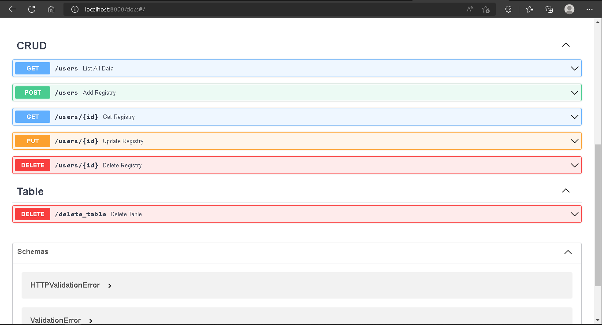

# Basic_api_for_db_CRUD


Python API to Create, Read, Update and Delete (CRUD) registries into a given database.

## Options

|**Method**|**Route**|**Description**|
|----------|---------|---------------|
|**GET**|/users|Show a json object with all stored users from database|
|**GET**|/users/{value}|Search for a user in database. Into "value" insert a "cedula" or "apellido" key|
|**POST**|/users|Send a json objetc to add a new registry to database ("id" is optional)|
|**PUT**|/users/{id}|Update the values of a user stored in database|
|**DELETE**|/users/{id}|Search a user by "id" and deletes it from database|
|**DELETE**|/delete_table|Drop the current table from the database|

## Environment preparation

### Set a virtual env (optional)
It's recommended to set a virtual env to installing and running the program, isolating our pc's enviroment from the program's envoriment.
You can use pip to install **virtualenv**:

- ```pip install virtualenv```

Then, create a folder when the program and the virtual enviroment will be installed.
Inside the folder, first, clone this API's repository and then create the virtual env:

- ```virtualenv 'your_proyect_name'```

This will create a folder with all the env files. To activate the enviroment, go inside that folder then scripts, and once into it, type ```activate``` to initializate the virtual enviroment.

Congratulations! Now, you have a isolated enviroment to run the API. Now let's intall the dependencies...

### Install dependencies
Go into the API folder. You can find a file named **requeriments.txt** will all needed dependencies to run the app:

```
anyio==3.6.1  
click==8.1.3      
colorama==0.4.5   
fastapi==0.85.0   
greenlet==1.1.3   
h11==0.13.0       
idna==3.4
pycodestyle==2.9.1
pydantic==1.10.2  
PyMySQL==1.0.2    
sniffio==1.3.0    
SQLAlchemy==1.4.41
starlette==0.20.4 
toml==0.10.2
typing_extensions==4.3.0
uvicorn==0.18.3
python-dotenv==0.21.0
```

Run the command: ```pip install -r requeriments.txt``` to install all dependencies.

### Set .env
Go into .env file and changue the values of the DB credentials to your DB credentials:

```
#DB credentials
DB_HOST=localhost
DB_USER=root
DB_PASSWORD=
DB_NAME=data
DB_ENGINE=mysql+pymysql
```
## Run API

Make sure you have activated the virtual enviroment and then into app folder run:

- ```uvicorn app:app --reload```

Where ```--reload```  is to auto load the server time to you save a new changue in any file.

## FastAPI Panel - Make CRUD to database

Go to```http://localhost:8000/docs```in your browser. You'll can see the FastAPI panel Where you'll can make calls to the different methods to make CRUD to darabase.



### Important
- If you call to method to drop the table, you'll have to restart the server to create a new table again.
- **id** key into the json objects, is not needed to insert, because it is autoincrementals.


